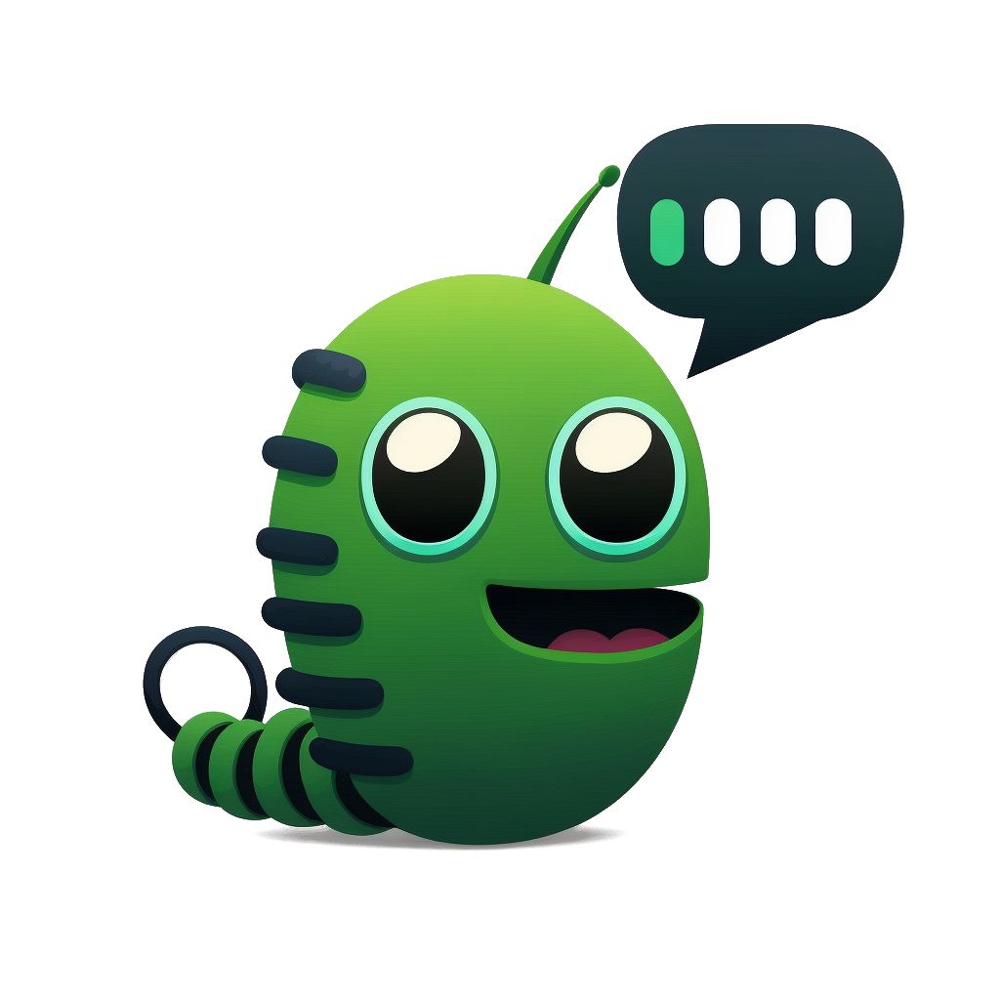

# Chat Worm
## A ChatGPT Client to access the API

**Web app**: https://chatworm.com/  
**Android app**: https://play.google.com/store/apps/details?id=com.chatworm.twa  
**Windows app**: https://apps.microsoft.com/store/detail/chatworm/9N1RF0VWV3SN  
  
Works also with the newest **GTP-4** Version if you got access from OpenAI to the new GTP4 model via API.  
Otherwise you have to wait and can use the older models instead.  
  
This is a single page application there is no server between your browser and Open AI. The app is just downloaded and cached by your browser and you communicate directly with the API.  

Example screenshot:  

## Setting Up Local Development
1. First, open a terminal and navigate to the project directory.
2. Run the command `npm install` to install all frontend packages.
3. Once the installation is complete, run `npm start`. 
4. This will start a web service accessible via http://localhost:4200/.

## Pull Request for Improvements?
1. Start coding changes to the project using your local setup.
2. Once the improvements have been made, run `npm build`. This will generate new files in the `dist` folder which are hosted on our demo page.
3. Create a pull request which includes the updated `dist` folder.

## Feature Requests or Bugs?
1. Open following: https://github.com/UnknownEnergy/chatgpt-api/issues
2. Create a new issue and decribe it as clear as possible. Screenshots can also help a lot. Thanks

## Deploy to production
1. Make sure everything is pushed to master.
2. Run `npm deploy` to deploy it to production server.
3. Check out https://chatworm.com/

## Release on different App Stores
1. Open https://www.pwabuilder.com/reportcard?site=https://chatworm.com
2. Release on the stores

## License
This project is licensed under the [MIT License](./LICENSE).
