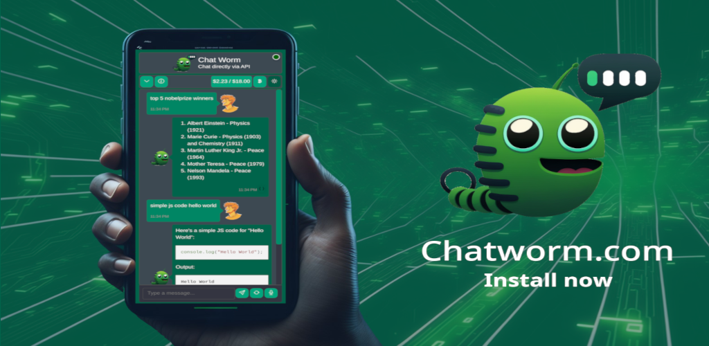
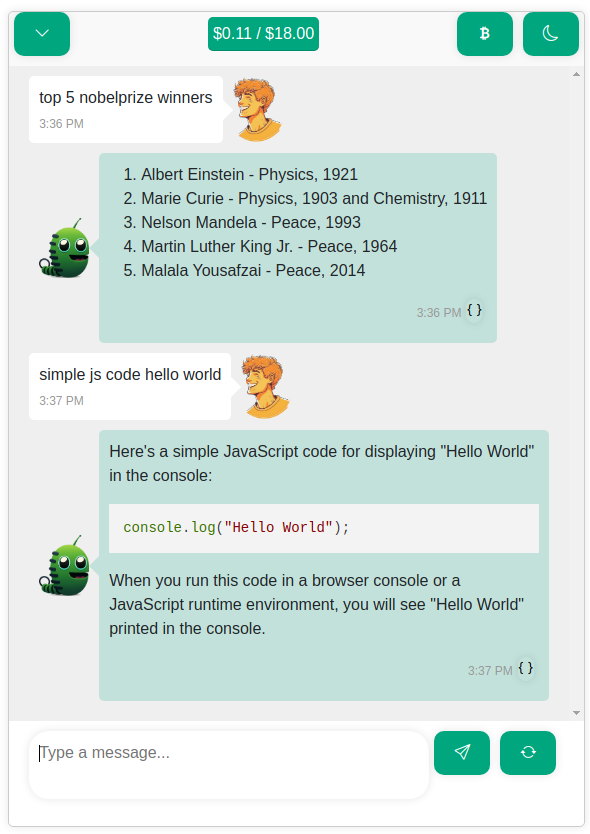

# Chat Worm
## Chat directly via API



**Demo Video**:  
[](https://www.youtube.com/shorts/i1r8eHARnIc)

**Web app**:   

https://chatworm.com/

**Android app**:  
<a href='https://play.google.com/store/apps/details?id=com.chatworm.twa&pcampaignid=pcampaignidMKT-Other-global-all-co-prtnr-py-PartBadge-Mar2515-1'></a>

**Windows app**:  
<a href="https://apps.microsoft.com/detail/Chatworm/9N1RF0VWV3SN?launch=true&mode=mini"></a>
  
Brand new Models of  
🤖 OpenAI
🤖 Anthropic  
🤖 Google Gemini  
🤖 Deepseek  
🤖 Alibaba Qwen  
🤖 xAI Grok  
    
This is a single page application there is no server between your browser and the model APIs. The app is just downloaded and cached by your browser and you communicate directly with the API.  

Example screenshot:  


## Setting Up Local Development
1. First, open a terminal and navigate to the project directory.
2. Run the command `npm install` to install all frontend packages.
3. Once the installation is complete, run `npm start`. 
4. This will start a web service accessible via http://localhost:4200/.

## Pull Request for Improvements?
1. Start coding changes to the project using your local setup.
2. Once the improvements have been made, run `npm run build`. This will generate new files in the `dist` folder which are hosted on our demo page.
3. Create a pull request which includes the updated `dist` folder.

## Feature Requests or Bugs?
1. Open following: https://github.com/UnknownEnergy/chatgpt-api/issues
2. Create a new issue and decribe it as clear as possible. Screenshots can also help a lot. Thanks

## Deploy to production
1. Make sure everything is pushed to master.
2. Run `npm run deploy` to deploy it to production server.
3. Check out https://chatworm.com/

## Release on different App Stores
1. Open https://www.pwabuilder.com/reportcard?site=https://chatworm.com
2. Release on the stores

## Update packages
- Run to update to latest versions: 
```bash
npx npm-check-updates -u
npm install --force 
``` 


## License
This project is licensed under the [MIT License](./LICENSE).
